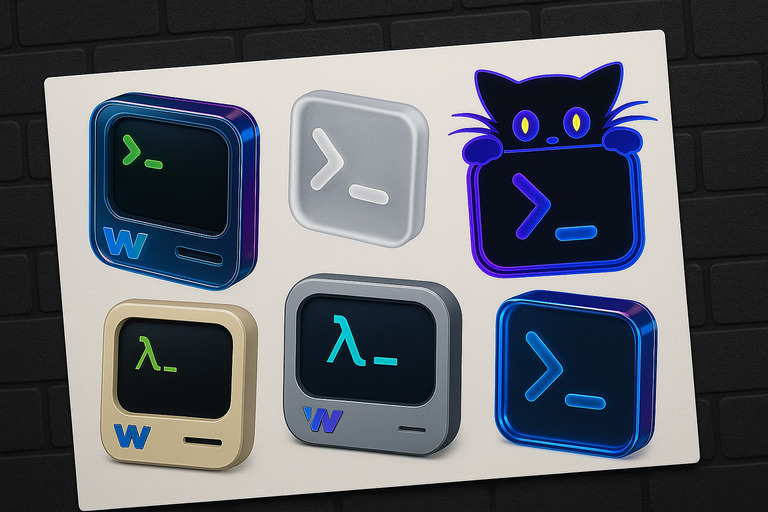

# 🎨 AI Icons Collection

Welcome to the curated collection of icons that I have generated using AI (so far, only OpenAI [gpt-image-1](https://platform.openai.com/docs/models/gpt-image-1)).

Most icons here have been generated by AI and some are refined and polished using various tools to ensure consistency, quality, and compatibility.

<center>

</center>

## 🚀 Download the icons

Clone this repository and use the icons according to your needs:
```bash
git clone https://github.com/nutthead/icons
```

## 📦 Icon Categories

At the moment, I have generated icons for the [Kitty Terminal](https://sw.kovidgoyal.net/kitty/) and [Wezterm](https://wezterm.org/index.html):
```text
┌── Kitty Terminal
│   ├── dark.bg
│   └── transparent.bg
└── Wezterm
    ├── 2d.originals.nobg
    ├── 3d.originals.nobg
    └── more
        └── icns
```

Some Wezterm icons also come in the [`.icns`](https://en.wikipedia.org/wiki/Apple_Icon_Image_format) file format. I will eventually automate the process for converting the original 1024x1024px AI generated images into proper icons and deliver `.icns` files for all the icons.

## 🤝 Contributing

While this is primarily a publication repository, suggestions for new icons are always welcome. Feel free to open an issue and request new icons.

## 📄 License

See [LICENSE](LICENSE).

## 🌟 Stay Updated

Star and watch this repository to get notified about new icon releases and updates to the collection.

---

<center>
<em>Crafted with AI, polished and delivered with love.</em>
</center>
